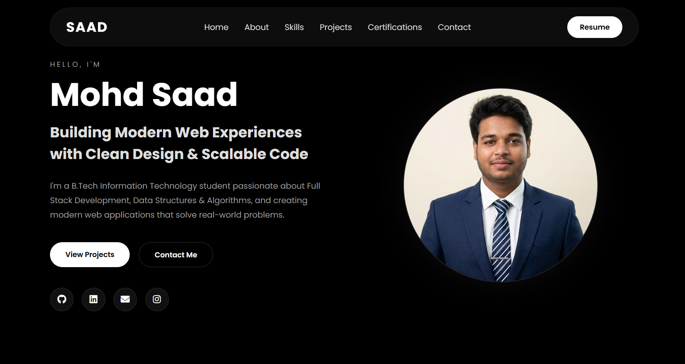
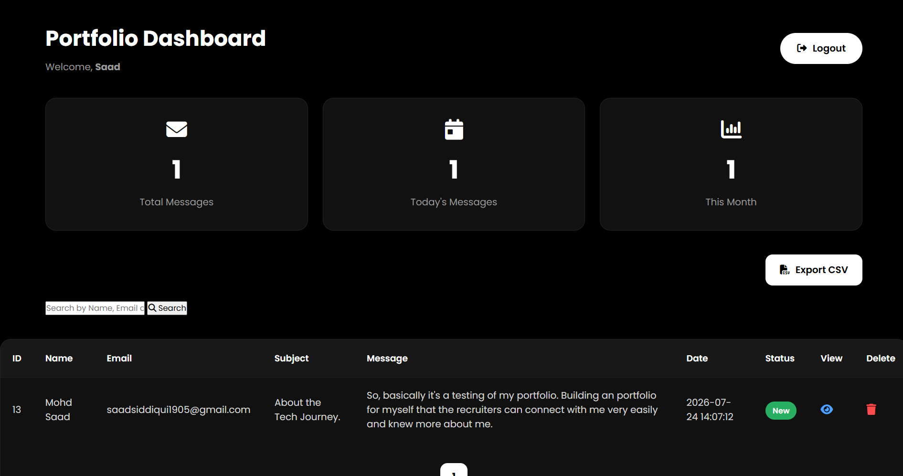

# 🌐 Saad's Portfolio
A modern **Full-Stack Developer Portfolio** built with **PHP, MySQL, HTML, CSS, and JavaScript**. The portfolio showcases my projects, skills, and achievements while providing a secure admin panel to manage contact messages efficiently.
---

### Home Page

### Admin Dashboard

---
## ✨ Features
### 👨‍💻 Portfolio
- Responsive modern UI
- Smooth scrolling navigation
- Skills section
- Project showcase
- Resume download
- Contact form
- Social media links
- Mobile-friendly design
### 📩 Contact System
- PHP backend
- MySQL database integration
- Form validation
- Secure prepared statements
- Email notifications using PHPMailer
- SweetAlert notifications
- Loading animation while sending
### 🔐 Admin Dashboard
- Secure Admin Login
- Password Hashing
- Session Authentication
- Dashboard Analytics
- Search Messages
- Pagination
- Read / Unread Status
- Delete Messages
- CSV Export
---
## 🛠 Tech Stack
### Frontend
- HTML5
- CSS3
- JavaScript
- Font Awesome
### Backend
- PHP
### Database
- MySQL
### Libraries
- PHPMailer
- Chart.js
- SweetAlert2
---
## 📂 Folder Structure
```text
Portfolio/
│
├── admin/
├── assets/
├── css/
├── database/
├── js/
├── pages/
├── php/
├── PHPMailer/
├── index.php
├── README.md
├── .env.example
└── .gitignore
```
---
## 🚀 Installation
### Clone Repository
```bash
git clone https://github.com/Saad-Sid85/saad-portfolio
```
Move the project into:
```text
xampp/htdocs/
```
Import
```text
database/portfolio.sql
```
Configure
```text
php/config.php
```
Configure
```text
php/mail_config.php
```
Start
- Apache
- MySQL
Open
```text
http://localhost/Portfolio
```
---
## 📬 Contact Form
The portfolio uses
- PHP
- MySQL
- PHPMailer
- Gmail SMTP
Every message is
- Stored inside MySQL
- Sent directly to the owner's email
---
## 🔒 Security
- Prepared Statements
- Password Hashing
- Session Authentication
- SMTP App Password
- Input Validation
---
## 📈 Future Improvements
- Visitor Analytics
- Theme Switcher
- Blog Section
- Project Categories
- Image Upload
- Admin Profile Settings
---
## 👨‍💻 Author
**Mohd Saad**
📧 Email:
saadsiddiqui1905@gmail.com

💼 LinkedIn:
https://www.linkedin.com/in/mohd-saad-71b25a402

📷 Instagram:
https://www.instagram.com/solivagant_s._/
---
## ⭐ Support
If you like this project,
please ⭐ the repository.
---
## 📄 License
This project is licensed under the MIT License.